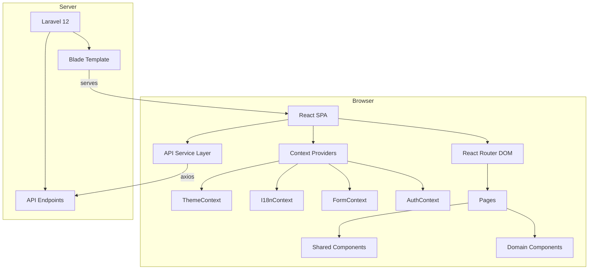
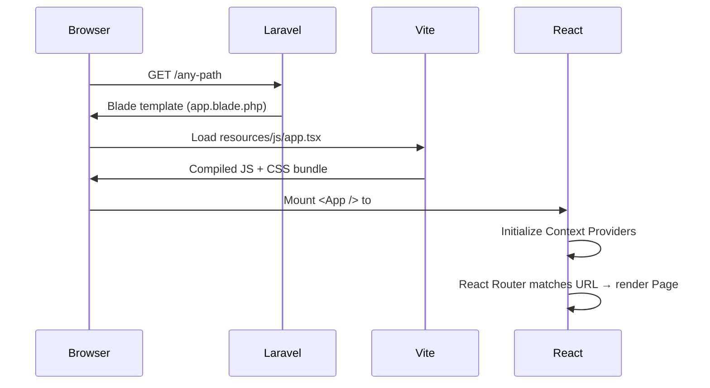
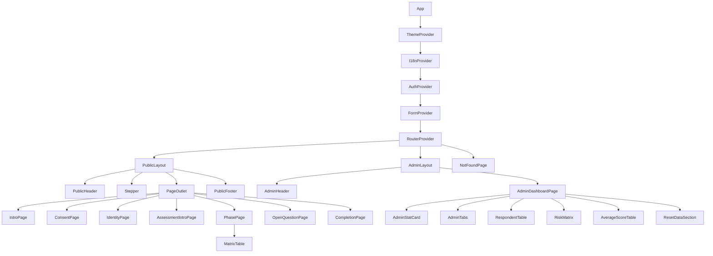
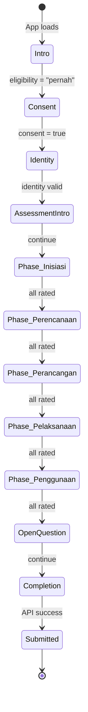

# Design Document: Questionnaire Frontend Rebuild

## Overview

This design describes the frontend architecture for the "Kuesioner Design and Build" single-page application. The system is a React 19 + TypeScript SPA served within a Laravel 12 shell, handling a 10-step public questionnaire flow for risk assessment data collection and an admin dashboard for response management.

The frontend is fully decoupled from the backend — Laravel provides a single catch-all Blade template, and all routing, state, and rendering happen client-side via React Router DOM 7. The backend API (developed by a teammate) is consumed through a typed axios-based service layer.

### Key Design Decisions

| Decision | Rationale |
|----------|-----------|
| React Context + useReducer over Redux/Zustand | Sufficient for form-scoped state; avoids external dependency overhead |
| React Router DOM 7 (not Inertia.js) | Full SPA control; Laravel is only a static shell |
| Tailwind CSS 4 via Vite plugin | Zero-config, design-token-driven styling with `@theme` directives |
| Axios over fetch | Interceptor support for auth token injection and 401 handling |
| Lucide React icons | Lightweight, tree-shakeable, consistent with design system |
| Single Blade catch-all route | All paths handled client-side; Laravel serves only the HTML shell |

## Architecture

### High-Level System Diagram



### Application Bootstrap Flow



### Rendering Strategy

Laravel defines a single catch-all route:

```php
Route::get('/{any?}', fn () => view('app'))->where('any', '.*');
```

The `app.blade.php` template includes the Vite-compiled assets:

```blade
<!DOCTYPE html>
<html lang="id">
<head>
    <meta charset="utf-8" />
    <meta name="viewport" content="width=device-width, initial-scale=1" />
    <title>Kuesioner Design and Build</title>
    @viteReactRefresh
    @vite(['resources/js/app.tsx'])
</head>
<body>
    <div id="app"></div>
</body>
</html>
```

## Components and Interfaces

### Component Hierarchy



### Routing Structure

| Path | Component | Step | Layout |
|------|-----------|------|--------|
| `/` | IntroPage | 1 - Mulai | PublicLayout (no stepper) |
| `/persetujuan` | ConsentPage | 2 - Persetujuan | PublicLayout |
| `/identitas` | IdentityPage | 3 - Identitas | PublicLayout |
| `/penilaian` | AssessmentIntroPage | 4 - Penilaian | PublicLayout |
| `/fase/inisiasi` | PhasePage | 5 - Idea | PublicLayout |
| `/fase/perencanaan` | PhasePage | 6 - Planning | PublicLayout |
| `/fase/perancangan` | PhasePage | 7 - Design | PublicLayout |
| `/fase/pelaksanaan` | PhasePage | 8 - Construction | PublicLayout |
| `/fase/penggunaan` | PhasePage | 9 - O&M | PublicLayout |
| `/pertanyaan-terbuka` | OpenQuestionPage | 9 - Terbuka | PublicLayout |
| `/selesai` | CompletionPage | 10 - Selesai | PublicLayout |
| `/admin/dashboard` | AdminDashboardPage | — | AdminLayout |
| `*` | NotFoundPage | — | None |

### Context Provider Interfaces

```typescript
// contexts/ThemeContext.tsx
interface ThemeContextValue {
  isDark: boolean;
  toggleDark: () => void;
}

// contexts/I18nContext.tsx
type Locale = 'id' | 'en';
interface I18nContextValue {
  locale: Locale;
  setLocale: (locale: Locale) => void;
  t: (key: string) => string;
}

// contexts/AuthContext.tsx
interface AuthContextValue {
  token: string | null;
  isAuthenticated: boolean;
  login: (username: string, password: string) => Promise<void>;
  logout: () => void;
}

// contexts/FormContext.tsx
interface FormContextValue {
  state: QuestionnaireState;
  dispatch: React.Dispatch<FormAction>;
  getStepValidation: (step: number) => boolean;
  resetForm: () => void;
}
```

### Shared UI Components

| Component | Props | Description |
|-----------|-------|-------------|
| `Button` | `variant: 'primary' \| 'secondary' \| 'ghost'`, `size`, `disabled`, `onClick`, `children` | Design-system button with 8px radius |
| `Card` | `variant: 'default' \| 'info' \| 'beige'`, `className`, `children` | 12px radius container with shadow |
| `InputField` | `label`, `name`, `type`, `placeholder`, `required`, `error`, `value`, `onChange` | Text input with #F3F0EA background |
| `RadioGroup` | `name`, `options: RadioOption[]`, `value`, `onChange`, `layout: 'vertical' \| 'horizontal'` | Grouped radio buttons |
| `SelectField` | `label`, `name`, `options`, `value`, `onChange` | Dropdown select |
| `TextareaField` | `label`, `name`, `maxLength`, `value`, `onChange`, `showCount` | Textarea with character counter |

### Domain Components

| Component | Props | Description |
|-----------|-------|-------------|
| `MatrixTable` | `phaseKey: PhaseKey`, `questions: RiskIndicator[]`, `answers: PhaseAnswers`, `onAnswer` | Assessment grid with probability/impact columns |
| `Stepper` | `currentStep: number`, `totalSteps: number` | Horizontal progress indicator |
| `PhaseScoreSummary` | `answered: number`, `total: number` | "38/38" completion display |
| `AdminLoginModal` | `isOpen`, `onClose`, `onLogin` | Modal with username/password fields |
| `AdminStatCard` | `label`, `value`, `icon` | Dashboard metric card |
| `AdminTabs` | `tabs: Tab[]`, `activeTab`, `onTabChange` | Phase filter tabs |
| `RespondentTable` | `respondents: Respondent[]`, `columns` | Paginated data table |
| `RiskMatrix` | `data: RiskMatrixData`, `phase: PhaseKey` | 6×6 color-coded grid |
| `AverageScoreTable` | `indicators: IndicatorScore[]` | Table with progress bars |
| `ResetDataSection` | `phases: PhaseKey[]`, `onReset` | Per-phase reset with confirmation |

## Data Models

### Questionnaire State Shape

```typescript
// types/questionnaire.ts
interface QuestionnaireState {
  currentStep: number;
  eligibility: 'pernah' | 'tidak_pernah' | null;
  consent: boolean;
  identity: IdentityData;
  answers: PhaseAnswers;
  openQuestions: OpenQuestionData;
  submissionStatus: 'idle' | 'submitting' | 'success' | 'error';
}

interface IdentityData {
  nama: string;
  perusahaan: string;
  telepon: string;
  email: string;
  kelompokUmur: string | null;
  pendidikan: string | null;
  posisiStakeholder: string | null;
  posisiLainnya: string;
  pengalamanKonstruksi: string | null;
  pengalamanProyekDB: string | null;
  fasePalingTerlibat: string | null;
  sektorProyek: string | null;
}

type PhaseKey = 'inisiasi' | 'perencanaan' | 'perancangan' | 'pelaksanaan' | 'penggunaan';

interface PhaseAnswers {
  [phaseKey: string]: {
    [questionId: string]: {
      probability: number | null;
      impact: number | null;
    };
  };
}

interface OpenQuestionData {
  [questionId: string]: string;
}
```

### API Response Types

```typescript
// types/api.ts
interface RiskIndicator {
  id: number;
  phase: PhaseKey;
  aspect: string;
  indicator: string;
  order: number;
}

interface QuestionsResponse {
  phase: PhaseKey;
  questions: RiskIndicator[];
}

interface SubmissionPayload {
  identity: IdentityData;
  answers: PhaseAnswers;
  openQuestions: OpenQuestionData;
}

interface SubmissionResponse {
  success: boolean;
  message: string;
  respondentId: number;
}

interface LoginResponse {
  token: string;
  expiresAt: string;
}

interface DashboardStats {
  totalRespondents: number;
  perPhase: Record<PhaseKey, number>;
}

interface RespondentRow {
  id: number;
  nama: string;
  instansi: string;
  posisi: string;
  pendidikan: string;
  pengalaman: string;
  sektor: string;
  createdAt: string;
}

interface RiskMatrixCell {
  probability: number;
  impact: number;
  count: number;
  score: number;
}

interface IndicatorScore {
  id: number;
  aspect: string;
  indicator: string;
  avgProbability: number;
  avgImpact: number;
  avgScore: number;
}
```

### Form Reducer Actions

```typescript
// types/formActions.ts
type FormAction =
  | { type: 'SET_ELIGIBILITY'; payload: 'pernah' | 'tidak_pernah' }
  | { type: 'SET_CONSENT'; payload: boolean }
  | { type: 'SET_IDENTITY_FIELD'; payload: { field: keyof IdentityData; value: string } }
  | { type: 'SET_ANSWER'; payload: { phase: PhaseKey; questionId: string; field: 'probability' | 'impact'; value: number } }
  | { type: 'SET_OPEN_QUESTION'; payload: { questionId: string; value: string } }
  | { type: 'SET_STEP'; payload: number }
  | { type: 'SET_SUBMISSION_STATUS'; payload: QuestionnaireState['submissionStatus'] }
  | { type: 'RESET_FORM' };
```

### State Flow Diagram



## Correctness Properties

*A property is a characteristic or behavior that should hold true across all valid executions of a system — essentially, a formal statement about what the system should do. Properties serve as the bridge between human-readable specifications and machine-verifiable correctness guarantees.*

### Property 1: Route-to-Component Mapping

*For any* valid questionnaire step URL in the defined route table, navigating to that URL shall render the corresponding step component. *For any* URL not in the route table, the application shall render the NotFoundPage component.

**Validates: Requirements 1.3, 1.4**

### Property 2: Stepper Visual State Consistency

*For any* step index from 1 to 10 set as the active step, the Stepper shall render all steps before it with a green completed indicator, the active step with a blue active indicator showing the step number, and all steps after it with a gray upcoming indicator. The text shall read "Langkah {activeStep} dari 10". The Stepper shall be hidden when step 1 is active.

**Validates: Requirements 3.2, 3.3, 3.4, 3.5, 3.7**

### Property 3: Form State Persistence Across Navigation

*For any* valid form data entered at any step (identity fields, matrix answers, or open question text), navigating to any other step and returning shall restore the previously entered values unchanged.

**Validates: Requirements 6.10, 9.2, 11.1, 11.2**

### Property 4: Step Validation Gate

*For any* step with required fields, the validation status shall be `true` (enabling the continue button) if and only if all required fields for that step contain valid non-empty values. For any step where a required field is empty, attempting to proceed shall display an inline validation error for that field.

**Validates: Requirements 6.11, 11.4**

### Property 5: Matrix Table Structure Invariant

*For any* list of N risk indicator questions provided to the MatrixTable, the component shall render exactly N rows, each containing a row number, question text, 6 probability radio options (0–5), and 6 impact radio options (0–5). Row backgrounds shall alternate between white and beige (#f3ece5).

**Validates: Requirements 8.2, 8.5**

### Property 6: Matrix Selection Visual Feedback

*For any* question row and any selected value V (0–5), selecting a probability value shall display a filled blue (#025695) circle with V, and selecting an impact value shall display a filled teal (#1c6775) circle with V in the corresponding cell.

**Validates: Requirements 8.3, 8.4**

### Property 7: Matrix Completion Tracking

*For any* phase with N total questions where M questions have both probability and impact rated, the completion summary shall display "M/N". The Form_Store shall store each answer at the path `answers[phaseKey][questionId][probability|impact]` and the stored value shall be retrievable at that same path.

**Validates: Requirements 8.6, 8.7**

### Property 8: Risk Level Color Mapping

*For any* risk score S (probability × impact), the color classification shall be: S = 0 → gray (No Risk), 1 ≤ S ≤ 4 → green (Low), 5 ≤ S ≤ 9 → yellow (Medium), 10 ≤ S ≤ 15 → orange (High), 16 ≤ S ≤ 25 → red (Very High). This mapping shall apply consistently to both the risk matrix cells and the average score progress bars.

**Validates: Requirements 14.2, 15.3**

### Property 9: Risk Matrix Cell Distribution

*For any* set of indicator scores for a phase, each cell at position (probability P, impact I) in the risk matrix shall display the count of indicators whose average probability rounds to P and average impact rounds to I. The sum of all cell counts shall equal the total number of indicators.

**Validates: Requirements 14.3**

### Property 10: Progress Bar Score Representation

*For any* indicator with an average score S where 0 ≤ S ≤ 25, the progress bar width shall be (S / 25) × 100% of the column width.

**Validates: Requirements 15.2**

### Property 11: Internationalization Switching

*For any* translation key present in both locale dictionaries, switching the locale from ID to EN (or vice versa) shall cause the `t(key)` function to return the string from the newly active locale's dictionary. The selected locale shall persist to localStorage and be restored on app reload.

**Validates: Requirements 2.4, 19.3, 19.4**

### Property 12: Dark Mode Persistence Round-Trip

*For any* dark mode state (true or false), toggling dark mode shall add or remove the `dark` class on the document root, persist the preference to localStorage, and restore it on subsequent app loads.

**Validates: Requirements 18.3, 18.4**

### Property 13: API Error Propagation

*For any* API function call, if the network returns an error, the API client shall throw a typed `ApiError`. If the response status is 401, the client shall additionally clear the stored authentication token and trigger the login modal display.

**Validates: Requirements 20.3, 20.4**

### Property 14: Admin Route Protection

*For any* route under the `/admin` path prefix, accessing it while the AuthContext has no valid token shall redirect to the public questionnaire and display the login modal.

**Validates: Requirements 12.5**

### Property 15: Auth Token Attachment

*For any* API request to an admin-scoped endpoint, the request shall include an `Authorization: Bearer {token}` header with the currently stored authentication token.

**Validates: Requirements 20.5**

## Error Handling

### Error Boundary Strategy

```typescript
// components/ErrorBoundary.tsx
// Wraps the entire app to catch unhandled React errors
// Displays a friendly error page with "Reload" action
```

### Error Categories and Handling

| Error Type | Source | Handling |
|------------|--------|----------|
| Network Error | API calls fail (no connectivity) | Display inline error message + retry button |
| 401 Unauthorized | Token expired or invalid | Clear token, show login modal, preserve current page state |
| 404 API Response | Resource not found | Display contextual "not found" message |
| 500 Server Error | Backend failure | Display generic error + retry button |
| Validation Error | Form submission rejected | Map field errors to inline messages |
| Submission Failure | Final form submit fails | Show error on CompletionPage + retry button |
| Question Fetch Failure | Phase questions unavailable | Show error card with retry on PhasePage |

### API Client Error Handling

```typescript
// services/api.ts
class ApiError extends Error {
  constructor(
    public status: number,
    public code: string,
    message: string
  ) {
    super(message);
  }
}

// Axios interceptor handles 401 globally:
// 1. Clears stored token
// 2. Dispatches auth context logout
// 3. Shows login modal via event or context
```

### Form Validation Strategy

- **Client-side validation** runs on blur and on step navigation attempt
- Required fields: `nama`, `perusahaan` (Step 3)
- Matrix completion: all questions must have both probability and impact rated before proceeding
- Validation errors display below the field with red text and a subtle red border
- The "Lanjutkan" button is disabled until step validation passes

## Testing Strategy

### Testing Stack

| Tool | Purpose |
|------|---------|
| Vitest | Test runner and assertion library |
| React Testing Library | Component rendering and interaction testing |
| fast-check | Property-based testing library |
| MSW (Mock Service Worker) | API mocking for integration tests |

### Test Categories

**Unit Tests (Example-Based)**
- Individual UI component rendering (Button, Card, InputField, RadioGroup)
- Page-level rendering with mock data (IntroPage, ConsentPage, etc.)
- Specific interactions (consent checkbox enables button, eligibility selection)
- Dark mode toggle behavior
- Admin login modal flow
- Responsive layout at specific breakpoints

**Property-Based Tests**
- Each correctness property (1–15) implemented as a fast-check property test
- Minimum 100 iterations per property
- Tag format: `Feature: questionnaire-frontend-rebuild, Property {N}: {title}`
- Focus areas:
  - Form state reducer (persistence, validation, answer storage)
  - Risk level color mapping function
  - Progress bar width calculation
  - i18n translation switching
  - Route matching logic
  - Stepper state derivation
  - Matrix completion counting

**Integration Tests**
- Full questionnaire flow (step 1 → step 10) with MSW-mocked API
- Admin authentication flow
- Dashboard data loading and display
- Excel download triggering
- Data reset with confirmation

**Property Test Configuration**
```typescript
// Example property test structure
import { fc } from 'fast-check';

// Feature: questionnaire-frontend-rebuild, Property 8: Risk Level Color Mapping
test('risk score maps to correct color for all valid scores', () => {
  fc.assert(
    fc.property(
      fc.integer({ min: 0, max: 5 }), // probability
      fc.integer({ min: 0, max: 5 }), // impact
      (probability, impact) => {
        const score = probability * impact;
        const color = getRiskColor(score);
        if (score === 0) expect(color).toBe('gray');
        else if (score <= 4) expect(color).toBe('green');
        else if (score <= 9) expect(color).toBe('yellow');
        else if (score <= 15) expect(color).toBe('orange');
        else expect(color).toBe('red');
      }
    ),
    { numRuns: 100 }
  );
});
```

### Test File Organization

```
resources/js/
├── __tests__/
│   ├── properties/          # Property-based tests
│   │   ├── formState.property.test.ts
│   │   ├── riskMapping.property.test.ts
│   │   ├── stepper.property.test.ts
│   │   ├── routing.property.test.ts
│   │   ├── i18n.property.test.ts
│   │   └── apiClient.property.test.ts
│   ├── unit/                # Example-based unit tests
│   │   ├── components/
│   │   └── pages/
│   └── integration/         # Full-flow integration tests
│       ├── questionnaireFlow.test.tsx
│       └── adminDashboard.test.tsx
```
